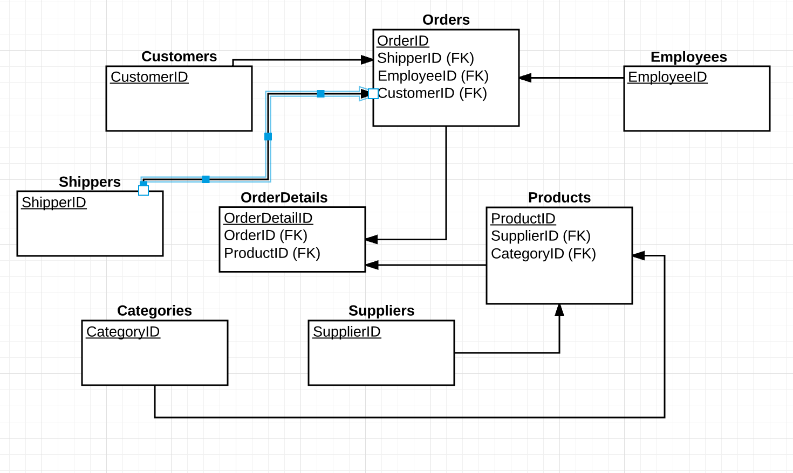

##### W3Schools Solution

1. Below is the ERD associated with the w3schools website.  The primary keys are indicated by an underline, and foreign keys are indicated by (FK).  The many side of all relationships is provided on the arrow side, while the one side of a relationship is indicated by the start of an arrow.  We can see that all many sides are on the side where the key is a foreign key.

 

2. Nothing to answer here.

3.
```sql
SELECT *
FROM Customers
WHERE Country IN ('Brazil', 'Germany', 'France');
```

4.
```sql
SELECT *
FROM Customers
WHERE Country = 'Brazil' OR Country = 'Germany' OR Country = 'France';
```

5.
```sql
SELECT *
FROM Customers
WHERE CustomerName LIKE 'A%';
```

6.
```sql
SELECT SupplierID, AVG(Price) mean_price, MAX(Price) max_price, MIN(Price) min_price, COUNT(*) num_products
FROM Products
GROUP BY SupplierID;
```

7.
```sql
SELECT CategoryID, AVG(Price) mean_price, MAX(Price) max_price, MIN(Price) min_price, COUNT(*) num_products
FROM Products
GROUP BY CategoryID
ORDER BY num_products DESC;
```

8.
```sql
SELECT P.SupplierID, S.SupplierName, S.City, S.Phone, AVG(P.Price) mean_price, MAX(P.Price) max_price, MIN(P.Price) min_price, COUNT(*) num_products
FROM Products P
JOIN Suppliers S
ON P.SupplierID = S.SupplierID
GROUP BY P.SupplierID, S.SupplierName, S.City, S.Phone;
```
9.
```sql
SELECT P.CategoryID, C.CategoryName, C.Description, AVG(P.Price) mean_price, MAX(P.Price) max_price, MIN(P.Price) min_price, COUNT(*) num_products
FROM Products P
JOIN Categories C
ON P.CategoryID = C.CategoryID
GROUP BY P.CategoryID, C.CategoryName, C.Description
ORDER BY num_products DESC;
```
10.
```sql
SELECT P.ProductID, P.ProductName, P.Price, SUM(OD.Quantity) num_purchased, SUM(OD.Quantity * P.Price) tot_spent
FROM Products P
JOIN OrderDetails OD
ON P.ProductID = OD.ProductID
GROUP BY P.ProductID, P.ProductName, P.Price
ORDER BY num_purchased DESC
LIMIT 1;

SELECT P.ProductID, P.ProductName, P.Price, SUM(OD.Quantity) num_purchased, SUM(OD.Quantity * P.Price) tot_spent
FROM Products P
JOIN OrderDetails OD
ON P.ProductID = OD.ProductID
GROUP BY P.ProductID, P.ProductName, P.Price
ORDER BY tot_spent DESC
LIMIT 1;

'''
The result of the above two queries should match if the product that was purchased most frequently is also the product that has more spent on it than any other product.  They are not the same, as shown by running the two above queries.
'''
```
