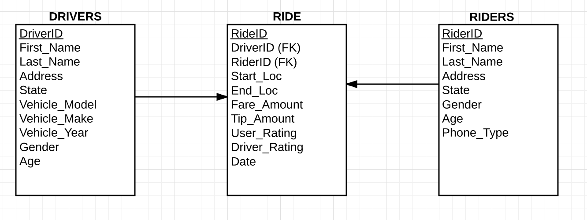

##### Uber Lab

For this lab, we will gain some practice with a database that simulates working with Uber data.  We will be using three tables to illustrate this example.  If you need to test your ideas, you can do so using [this](http://sqlfiddle.com/) site.  It is possible to build out the database by writing queries in the top, left screen, and you can test your code with queries in the top right screen.  Notice, it is also possible to change the environment that executes your SQL code using the top tool bar.  Most of the syntax will be the same regardless of your SQL environment; however, there are differences in the way that you might go about creating temporary tables, working with dates, and working with strings depending on your environment.  I am comfortable with you using whatever environment you prefer, but please specify for the purpose of reproduction.

___________

There are three tables to consider with answering the following questions.  As some columns are not straight forward in terms of how they might exist in a table, the details of these columns are provided below.

**DRIVERS:**

* Address - an email address associated with the driver
* State - Includes all 50 states in the form of their two-letter state code as a VARCHAR.

* Gender - Provided as "M" and "F"
* Age - the age of the driver in years

**RIDERS:**

* Phone_Type - Two options: "iOS" and "Android"

**RIDE:**

* Start_Loc and End_Loc - Given as latitude, longitude pairs.  For example, "(39.7392, 104.9903)" would be the VARCHAR for Denver.

* Tip_Amount and Fare_Amount - dollar amounts

* Driver_Rating - rating given to a driver by a user on a 1 to 5 scale

* User_Rating - rating given to a user by a driver on a 1 to 5 scale

* Date - formatted in the following format 2001-07-01 00:00:00.000.  We have minute to minute data for March 2009 to the present
______________

1. Create a table with the average rating for each driver; order by highest rating to lowest.

2. Now we only want to consider drivers who have 10 or more ratings; continue to order highest rating first.

3. Find the states with the highest tip rates.  The value used to determine the highest tip rates should be calculated in a way that suggests the highest rate.  

4. We would like to know if raters of certain phone types are more likely to rate an uber driver higher than those of an alternative phone type.  How would you go about answering this question?

5. We would like to understand how the number of users is changing over time.  Write a query that provides an idea of how the number of users is changing.  Consider how you might think it is best to judge the changes.

6. We want to know if there are certain demographics of drivers that are associated with higher ratings.  The two areas of interest are `age` and `gender`.  However, there are drivers from the age of 21 to the age of 73.  Generate a table that allows us to easily see the similarities and differences between multiple categories of `age` and `gender`.  The [following](https://community.modeanalytics.com/sql/tutorial/sql-case/) documentation will likely be beneficial.  

7. We would like to know the number of times each user has ridden with uber.  

8. For users who have not ridden with uber in the last 3 months, we would like to send a promotional code.  Generate a list of these user email addresses for us to send promotional codes.  

9. We want to keep track of our growth by looking at the number of new users each year.  Write a query that gives us the number of new users each year.

10.  For riders who are also drivers for uber, uber uses the same `DriverID` as `RiderID`.  With this in mind, uber would like to make sure these individuals are not padding their ratings.  Identify rides where these paddings may have occurred.  What would we want to do with these ratings in practice?

11. We would like to identify whether users are more likely to use uber in their home areas or in other areas.  There might be hard and easy ways to answer this question.

12. We want to identify the tip amounts 'when traveling' and how they compare to those 'near home'.  Write a query that performs this task.  Do individuals appear to tip higher when traveling?
